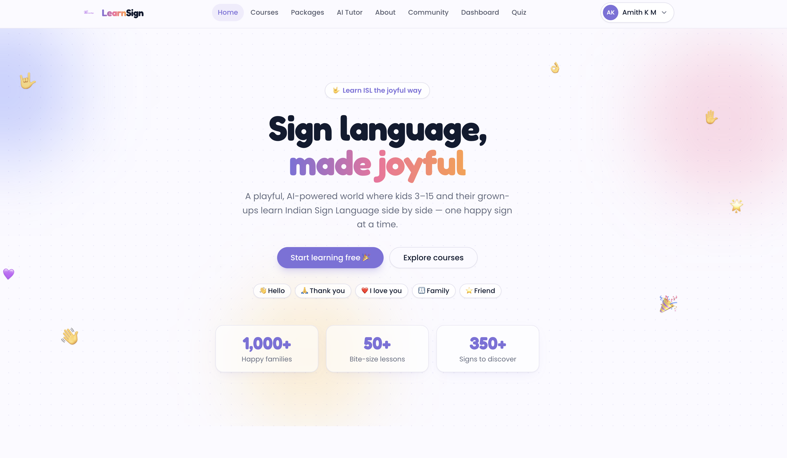
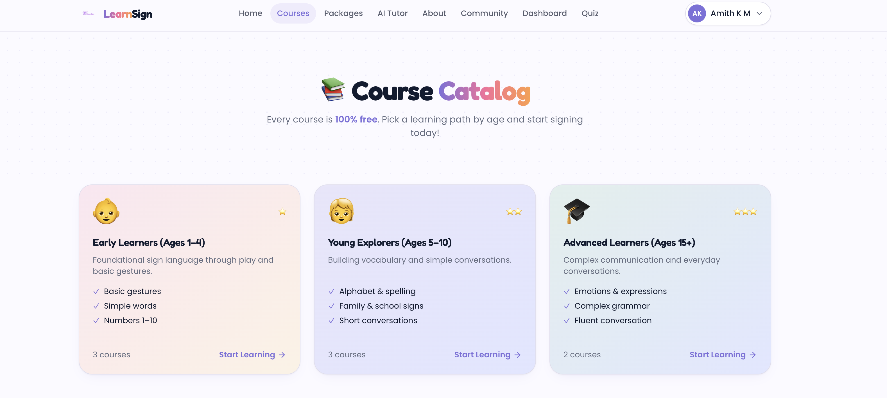
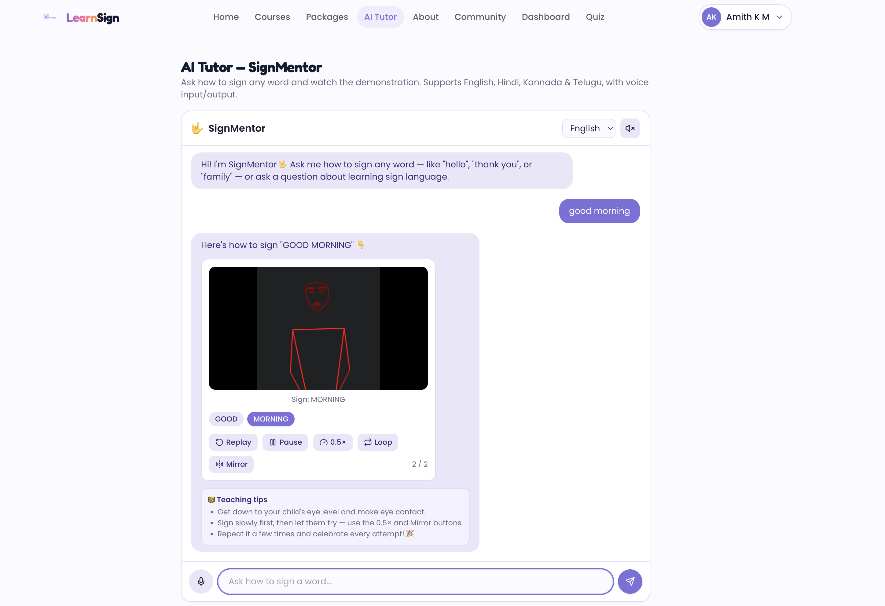
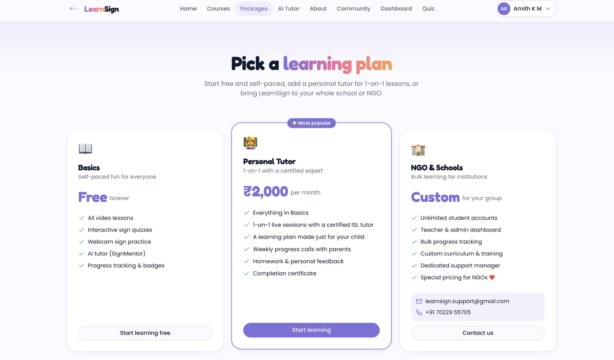
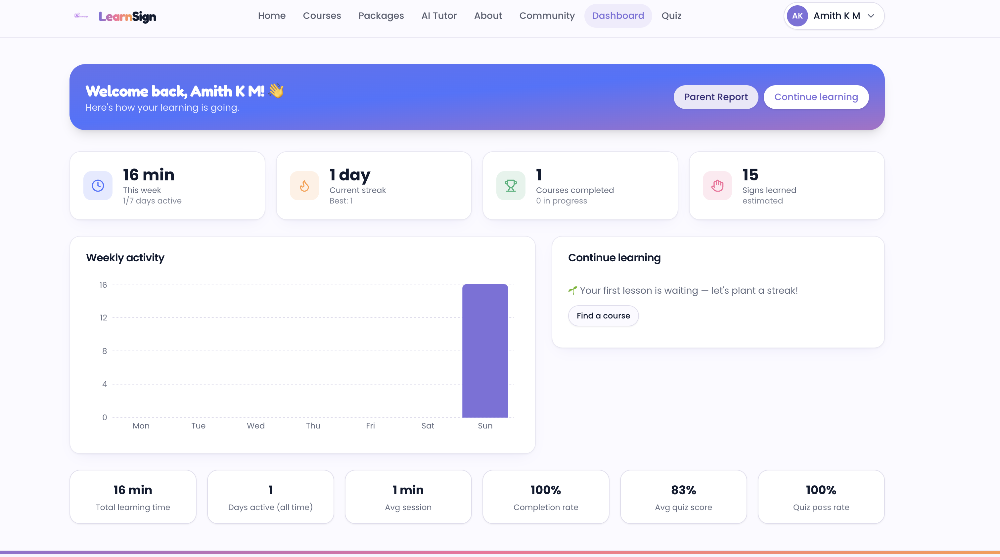
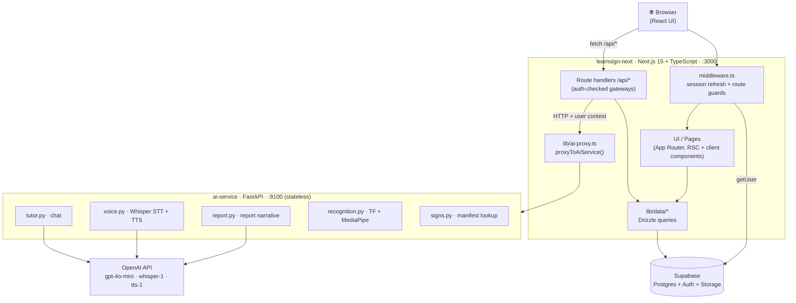
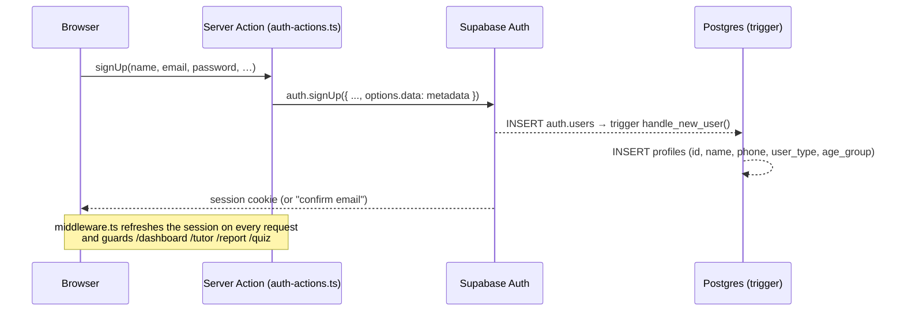
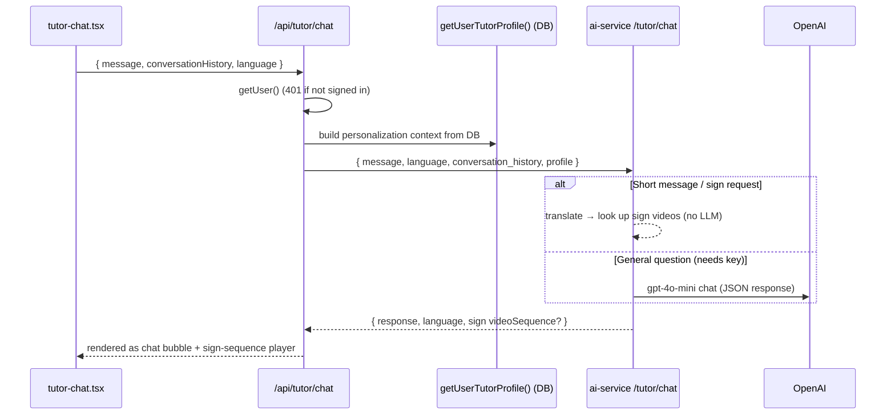
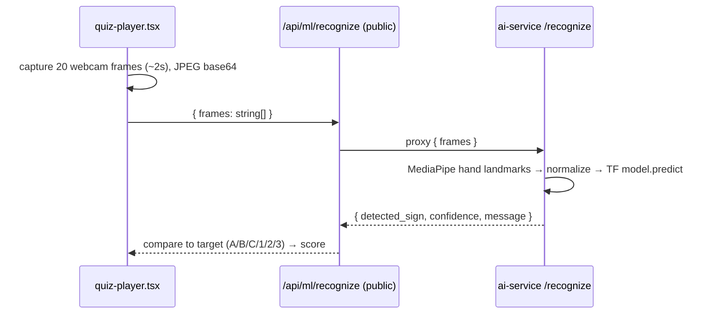

# LearnSign 

> Interactive, AI-powered platform for learning **Indian Sign Language (ISL)** — video
> lessons, an AI tutor with voice, a webcam sign-recognition quiz, progress tracking,
> and AI-generated parent reports. Built for children (ages 3–15) and their parents.

<p>
  
  
  
  
  
  
</p>

---

## Table of contents

- [Overview](#overview)
- [Features](#features)
- [Architecture](#architecture)
- [Repository structure](#repository-structure)
- [Tech stack](#tech-stack)
- [How the key flows work](#how-the-key-flows-work)
- [Data model](#data-model)

---

## Overview

LearnSign teaches Indian Sign Language through short video lessons, an interactive AI
tutor (text **and** voice, in English / Hindi / Kannada / Telugu), and a webcam quiz
that recognises hand signs in real time. Parents get a dashboard and an AI-written
progress report.

The system is split into **two independently deployable services**:

| Service | Role | Tech | Port (dev) |
|---|---|---|---|
| **`learnsign-next`** | The **gateway**: all UI, authentication, database access, and business logic. | Next.js 15 (App Router) + TypeScript | `3000` (`3100` in some scripts) |
| **`ai-service`** | The **stateless AI brain**: LLM chat, voice, report narrative, sign recognition. Holds no DB and no auth. | Python / FastAPI | `8100` |

> **Design principle:** the browser **only ever talks to the Next.js app**. Next verifies
> the user, gathers their context from the database, and proxies AI requests to the Python
> service. Python never touches the database or auth — Next passes everything it needs.

---

## Features

| Feature | What it does |
|---|---|
| 🤟 **AI Tutor (SignMentor)** | Ask how to sign any word, in text or voice, and watch the demonstration. |
| 📚 **Courses** | Free video lessons grouped by age: 1–4, 5–10, and 15+. |
| 🧠 **Quiz** | A webcam game that checks your hand signs and scores you. |
| 📊 **Dashboard** | Streaks, weekly activity, and quiz stats at a glance. |
| 📝 **Parent report** | A printable, AI-written summary of your child's progress. |
| 🌐 **Multilingual** | Works in English, Hindi, Kannada, and Telugu. |

### 🏠 Home

A playful landing page for kids 3–15 and their parents — pick a path and start signing.



### 📚 Courses

Free lessons by age group: **Early Learners (1–4)**, **Young Explorers (5–10)**, and **Advanced (15+)**.



### 🤟 AI Tutor — SignMentor

Ask how to sign anything and watch it. It understands full sentences, fingerspells words it doesn't have a sign for, and gives teaching tips with mirror / loop / slow-motion controls.



### 💳 Packages

A free self-paced plan, a paid 1-on-1 Personal Tutor, and custom plans for NGOs & schools.



### 📊 Dashboard

Track streaks, weekly activity, and quiz stats — plus a printable parent report.



---

## Architecture



**Why two services?** All *data* (auth, courses, progress, analytics SQL) lives in
TypeScript; all *AI/ML* (LLM, speech, computer-vision) lives in Python. This keeps the
heavy ML dependencies isolated and lets each side scale and deploy on its own.

---

## Repository structure

```
LearnSign_pro_/
├── learnsign-next/            # Next.js web app (frontend + gateway API)
│   ├── src/
│   │   ├── app/
│   │   │   ├── (auth)/        # login, register, forgot-password
│   │   │   ├── (site)/        # home, about, community, courses, learn,
│   │   │   │                  #   packages, dashboard, tutor, quiz, report
│   │   │   ├── auth/          # callback route + update-password
│   │   │   └── api/           # learning/events, ml/recognize, quiz/submit,
│   │   │                      #   report, tutor/chat, voice/chat, voice/text-to-speech
│   │   ├── components/        # layout, auth, learn, tutor, quiz, report,
│   │   │                      #   dashboard, packages, marketing, motion, ui
│   │   ├── lib/               # auth, db (Drizzle), supabase, data/*, ai-proxy,
│   │   │                      #   validations, utils
│   │   ├── server/            # auth-actions.ts (server actions)
│   │   └── middleware.ts      # session refresh + protected-route guard
│   ├── drizzle/              # SQL migrations + manual/ RLS & trigger SQL
│   ├── scripts/             # seed, import-users, apply-sql, smoke-http, verify-db
│   └── public/assets/       # videos/ (signs *.webm + course *.mp4), imgs/
│
├── ai-service/                # Python FastAPI AI service
│   ├── app/
│   │   ├── main.py           # FastAPI app + routes
│   │   ├── config.py         # env + OpenAI presence
│   │   ├── schemas.py        # Pydantic request/response models
│   │   ├── tutor.py          # chat core + OpenAI integration
│   │   ├── language.py       # regional → English-sign translation
│   │   ├── signs.py          # sign-video manifest lookup
│   │   ├── voice.py          # Whisper STT + TTS
│   │   ├── report.py         # parent-report narrative
│   │   ├── recognition.py    # TF + MediaPipe sign recognition (lazy-loaded)
│   │   ├── data/             # sign_translations.json, signs_manifest.json, tutor_prompt.txt
│   │   └── models/           # sign_language_numbers_letters.h5
│   ├── requirements.txt
│   └── Dockerfile
│
├── docs/screenshots/          # images embedded in this README
└── README.md                  # ← this file
```

---

## Tech stack

**Web (`learnsign-next`)**
- Next.js 15 (App Router, RSC), React 19, TypeScript 5.7
- Tailwind CSS 3 + shadcn/ui (new-york style) · framer-motion (animation) · lucide-react (icons)
- TanStack Query (configured) · Zod (validation) · recharts (charts)
- Drizzle ORM over `postgres-js` · `@supabase/ssr` + `@supabase/supabase-js`

**AI service (`ai-service`)**
- Python 3.10–3.12 · FastAPI + Uvicorn · Pydantic v2
- OpenAI SDK — `gpt-4o-mini` (chat & report), `whisper-1` (STT), `tts-1` (TTS)
- TensorFlow 2.16.2 + `tf-keras` 2.16.0 + MediaPipe 0.10.14 + OpenCV + NumPy (lazy-loaded for `/recognize`)

**Platform**
- Supabase — Postgres (data), Auth (email/password + Google OAuth), Storage
- Brand colour: lavender **`#7C6FDB`**

> ⚠️ **Pinned ML deps — do not bump.** TensorFlow/MediaPipe require **Python ≤ 3.12**
> (not 3.13/3.14). MediaPipe must stay `0.10.14` (later versions removed the
> `mp.solutions` API), and `protobuf` must stay `4.x` (`>=4.25.3,<5`). See
> `ai-service/requirements.txt`.

---

## How the key flows work

### Authentication (Supabase SSR)



Every request runs `middleware.ts → updateSession()`, which calls
`supabase.auth.getUser()` (revalidates the JWT, not just reads the cookie). Protected
routes redirect unauthenticated users to `/login?redirectTo=…`.

### AI tutor chat (Next gateway → Python brain)



Voice chat (`/api/voice/chat`) is the same pipeline wrapped with Whisper STT on the way
in and `tts-1` TTS on the way out.

### Quiz sign recognition



---

## Data model


- **`profiles`** is created automatically by the `handle_new_user()` trigger when a row is
  added to `auth.users`. RLS: users can view/update only their own.
- **`user_progress`** has a **unique index on `(user_id, course_id)`** — the upsert target.
- **`learning_events`** is append-only telemetry; analytics aggregate over it.
- **Note:** `course_id` columns are plain text with **no foreign key** to `courses`, and
  `packages.course_ids` is a text array (no referential integrity).
