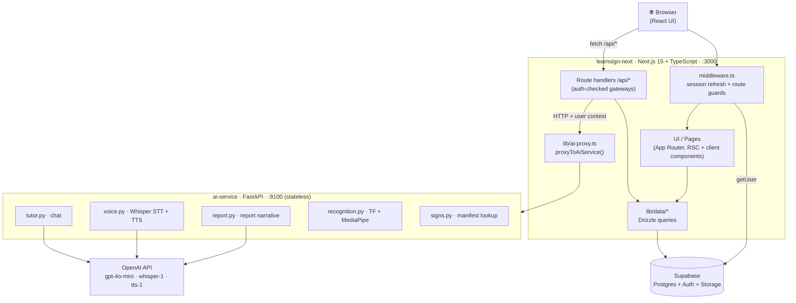
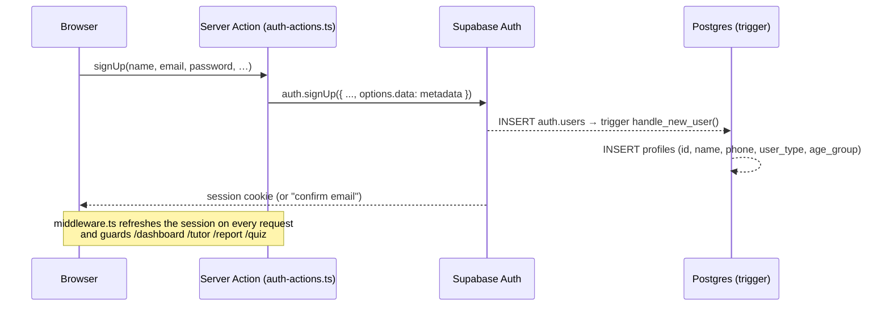
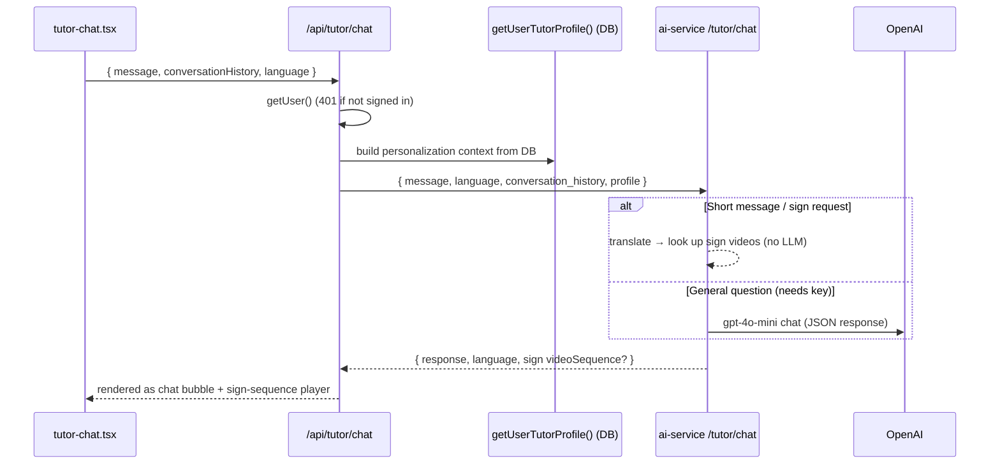
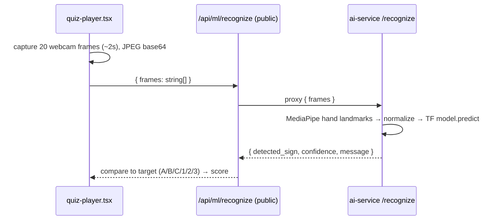
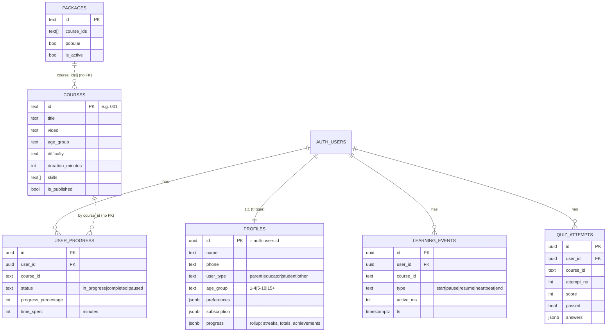

# LearnSign 🤟

> Interactive, AI-powered platform for learning **Indian Sign Language (ISL)** — video
> lessons, an AI tutor with voice, a webcam sign-recognition quiz, progress tracking,
> and AI-generated parent reports. Built for children (ages 3–15) and their parents.

<p>
  
  
  
  
  
  
</p>

---

## Table of contents

- [Overview](#overview)
- [Architecture](#architecture)
- [Repository structure](#repository-structure)
- [Tech stack](#tech-stack)
- [Features](#features)
- [How the key flows work](#how-the-key-flows-work)
- [Data model](#data-model)
- [API reference](#api-reference)
- [Getting started](#getting-started)
- [Environment variables](#environment-variables)
- [Database, migrations & RLS](#database-migrations--rls)
- [Scripts](#scripts)
- [Sign data & ML recognition (reality check)](#sign-data--ml-recognition-reality-check)
- [Design system](#design-system)
- [Deployment](#deployment)
- [Known limitations & roadmap](#known-limitations--roadmap)

---

## Overview

LearnSign teaches Indian Sign Language through short video lessons, an interactive AI
tutor (text **and** voice, in English / Hindi / Kannada / Telugu), and a webcam quiz
that recognises hand signs in real time. Parents get a dashboard and an AI-written
progress report.

The system is split into **two independently deployable services**:

| Service | Role | Tech | Port (dev) |
|---|---|---|---|
| **`learnsign-next`** | The **gateway**: all UI, authentication, database access, and business logic. | Next.js 15 (App Router) + TypeScript | `3000` (`3100` in some scripts) |
| **`ai-service`** | The **stateless AI brain**: LLM chat, voice, report narrative, sign recognition. Holds no DB and no auth. | Python / FastAPI | `8100` |

> **Design principle:** the browser **only ever talks to the Next.js app**. Next verifies
> the user, gathers their context from the database, and proxies AI requests to the Python
> service. Python never touches the database or auth — Next passes everything it needs.

---

## Architecture



**Why two services?** All *data* (auth, courses, progress, analytics SQL) lives in
TypeScript; all *AI/ML* (LLM, speech, computer-vision) lives in Python. This keeps the
heavy ML dependencies isolated and lets each side scale and deploy on its own.

---

## Repository structure

```
LearnSign_pro_/
├── learnsign-next/            # Next.js web app (frontend + gateway API)
│   ├── src/
│   │   ├── app/
│   │   │   ├── (auth)/        # login, register, forgot-password
│   │   │   ├── (site)/        # home, about, community, courses, learn,
│   │   │   │                  #   packages, dashboard, tutor, quiz, report
│   │   │   ├── auth/          # callback route + update-password
│   │   │   └── api/           # learning/events, ml/recognize, quiz/submit,
│   │   │                      #   report, tutor/chat, voice/chat, voice/text-to-speech
│   │   ├── components/        # layout, auth, learn, tutor, quiz, report,
│   │   │                      #   dashboard, packages, marketing, motion, ui
│   │   ├── lib/               # auth, db (Drizzle), supabase, data/*, ai-proxy,
│   │   │                      #   validations, utils
│   │   ├── server/            # auth-actions.ts (server actions)
│   │   └── middleware.ts      # session refresh + protected-route guard
│   ├── drizzle/              # SQL migrations + manual/ RLS & trigger SQL
│   ├── scripts/             # seed, import-users, apply-sql, smoke-http, verify-db
│   └── public/assets/       # videos/ (signs *.webm + course *.mp4), imgs/
│
├── ai-service/                # Python FastAPI AI service
│   ├── app/
│   │   ├── main.py           # FastAPI app + routes
│   │   ├── config.py         # env + OpenAI presence
│   │   ├── schemas.py        # Pydantic request/response models
│   │   ├── tutor.py          # chat core + OpenAI integration
│   │   ├── language.py       # regional → English-sign translation
│   │   ├── signs.py          # sign-video manifest lookup
│   │   ├── voice.py          # Whisper STT + TTS
│   │   ├── report.py         # parent-report narrative
│   │   ├── recognition.py    # TF + MediaPipe sign recognition (lazy-loaded)
│   │   ├── data/             # sign_translations.json, signs_manifest.json, tutor_prompt.txt
│   │   └── models/           # sign_language_numbers_letters.h5
│   ├── requirements.txt
│   └── Dockerfile
│
├── docs/                      # screenshots & guides
└── README.md                  # ← this file
```

---

## Tech stack

**Web (`learnsign-next`)**
- Next.js 15 (App Router, RSC), React 19, TypeScript 5.7
- Tailwind CSS 3 + shadcn/ui (new-york style) · framer-motion (animation) · lucide-react (icons)
- TanStack Query (configured) · Zod (validation) · recharts (charts)
- Drizzle ORM over `postgres-js` · `@supabase/ssr` + `@supabase/supabase-js`

**AI service (`ai-service`)**
- Python 3.10–3.12 · FastAPI + Uvicorn · Pydantic v2
- OpenAI SDK — `gpt-4o-mini` (chat & report), `whisper-1` (STT), `tts-1` (TTS)
- TensorFlow 2.16.2 + `tf-keras` 2.16.0 + MediaPipe 0.10.14 + OpenCV + NumPy (lazy-loaded for `/recognize`)

**Platform**
- Supabase — Postgres (data), Auth (email/password + Google OAuth), Storage
- Brand colour: lavender **`#7C6FDB`**

> ⚠️ **Pinned ML deps — do not bump.** TensorFlow/MediaPipe require **Python ≤ 3.12**
> (not 3.13/3.14). MediaPipe must stay `0.10.14` (later versions removed the
> `mp.solutions` API), and `protobuf` must stay `4.x` (`>=4.25.3,<5`). See
> `ai-service/requirements.txt`.

---

## Features

| Area | What it does | Where |
|---|---|---|
| **Marketing site** | Animated home, about, community pages | `(site)/page.tsx`, `about`, `community` |
| **Auth** | Email/password + Google OAuth, password reset, route guards | `(auth)/*`, `server/auth-actions.ts`, `middleware.ts` |
| **Courses** | Catalog by age group (1-4 / 5-10 / 15+), video lessons with objectives | `(site)/courses`, `learn/[id]`, `lesson-player.tsx` |
| **Progress tracking** | Visible-tab watch-time tracking, heartbeats, streaks | `api/learning/events`, `lesson-player.tsx` |
| **AI Tutor** | Text + voice chat in EN/HI/KN/TE; returns sign-video sequences | `(site)/tutor`, `tutor-chat.tsx`, Python `tutor.py` |
| **Quiz** | Webcam recognises A/B/C & 1/2/3 hand signs | `(site)/quiz`, `quiz-player.tsx`, Python `recognition.py` |
| **Dashboard** | Weekly activity chart, streaks, continue-learning, quiz stats | `(site)/dashboard`, `lib/data/analytics.ts` |
| **Parent report** | Stats + charts (TS) + AI narrative (Python), printable to PDF | `(site)/report`, `api/report`, Python `report.py` |
| **Packages** | Pricing tiers (currently hardcoded UI) | `(site)/packages`, `pricing-tiers.tsx` |

### Page map

| Route | Access | Notes |
|---|---|---|
| `/` `/about` `/community` `/courses` `/courses/[ageGroup]` `/packages` | Public | |
| `/learn/[id]` | Public | Progress only tracked when logged in |
| `/tutor` | Public link, **redirects to login** | guarded by middleware |
| `/dashboard` `/quiz` `/report` | **Protected** | guarded by middleware |
| `/login` `/register` `/forgot-password` `/auth/update-password` | Auth flow | |

---

## How the key flows work

### Authentication (Supabase SSR)



Every request runs `middleware.ts → updateSession()`, which calls
`supabase.auth.getUser()` (revalidates the JWT, not just reads the cookie). Protected
routes redirect unauthenticated users to `/login?redirectTo=…`.

### AI tutor chat (Next gateway → Python brain)



Voice chat (`/api/voice/chat`) is the same pipeline wrapped with Whisper STT on the way
in and `tts-1` TTS on the way out.

### Quiz sign recognition



---

## Data model



- **`profiles`** is created automatically by the `handle_new_user()` trigger when a row is
  added to `auth.users`. RLS: users can view/update only their own.
- **`user_progress`** has a **unique index on `(user_id, course_id)`** — the upsert target.
- **`learning_events`** is append-only telemetry; analytics aggregate over it.
- **Note:** `course_id` columns are plain text with **no foreign key** to `courses`, and
  `packages.course_ids` is a text array (no referential integrity).

---

## API reference

### Next.js gateway routes (`learnsign-next/src/app/api`)

| Method | Path | Auth | Purpose |
|---|---|---|---|
| `POST` | `/api/learning/events` | ✅ session | Record a learning event; roll up `user_progress` + streak |
| `POST` | `/api/quiz/submit` | ✅ session | Record a quiz attempt (auto-increment `attempt_no`) |
| `GET`  | `/api/report` | ✅ session | Gather report data + AI narrative (5-min cache; `?refresh=1`) |
| `POST` | `/api/tutor/chat` | ✅ session | Proxy to Python `/tutor/chat` with DB-derived profile |
| `POST` | `/api/voice/chat` | ✅ session | Proxy to Python `/voice/chat` (audio → reply + speech) |
| `POST` | `/api/voice/text-to-speech` | ✅ session | Proxy to Python `/voice/tts` |
| `POST`/`GET` | `/api/ml/recognize` | ⚠️ **public** | Proxy to Python `/recognize`; GET = health check |
| `GET`  | `/auth/callback` | public | OAuth / email-confirm / password-reset code exchange |

### Python AI service endpoints (`ai-service/app/main.py`)

| Method | Path | Purpose | Needs OpenAI key |
|---|---|---|---|
| `GET`  | `/health` | Liveness + whether OpenAI is configured | – |
| `POST` | `/tutor/chat` | Tutor chat (sign lookup works without a key) | optional |
| `POST` | `/voice/chat` | Whisper STT → tutor → TTS | ✅ (503 without) |
| `POST` | `/voice/tts` | Text → speech (mp3 base64) | ✅ (503 without) |
| `POST` | `/report/insights` | Parent-report narrative (falls back to template) | optional |
| `POST` | `/recognize` | Sign recognition from webcam frames | – |

---

## Getting started

**Prerequisites:** Node 18+, Python 3.10–3.12, a Supabase project, and (optionally) an
OpenAI API key. Sign-video lookup works without OpenAI; chat/voice/report need a valid key.

### 1. AI service

```bash
cd ai-service
python3.10 -m venv .venv && source .venv/bin/activate
pip install -r requirements.txt
cp .env.example .env          # add OPENAI_API_KEY (optional but recommended)
python -m app.main            # → http://localhost:8100
```

### 2. Web app (new terminal)

```bash
cd learnsign-next
npm install
cp .env.local.example .env.local   # add Supabase keys + DATABASE_URL + AI_SERVICE_URL
npm run db:migrate                 # apply drizzle/*.sql migrations
node scripts/apply-sql.mjs drizzle/manual/0001_profiles_rls_trigger.sql
node scripts/apply-sql.mjs drizzle/manual/0002_courses_packages_rls.sql
node scripts/apply-sql.mjs drizzle/manual/0003_progress_rls.sql
node scripts/apply-sql.mjs drizzle/manual/0004_oauth_profile.sql
node scripts/seed.mjs              # seed 8 courses + 3 packages
npm run dev                        # → http://localhost:3000
```

> **Google login** also requires enabling the Google provider in the Supabase dashboard
> (Auth → Providers) and adding `http://localhost:3000/auth/callback` (and your prod URL)
> to Auth → URL Configuration.

---

## Environment variables

### `learnsign-next/.env.local`

| Variable | Description |
|---|---|
| `NEXT_PUBLIC_SUPABASE_URL` | Supabase project URL |
| `NEXT_PUBLIC_SUPABASE_ANON_KEY` | Supabase anon (public) key |
| `SUPABASE_SERVICE_ROLE_KEY` | Service-role key (used by `import-users` script) |
| `DATABASE_URL` | Postgres connection string — **use the Supabase pooler** (`?sslmode=require`) |
| `AI_SERVICE_URL` | Base URL of the Python service (default `http://localhost:8100`) |

### `ai-service/.env`

| Variable | Description |
|---|---|
| `OPENAI_API_KEY` | OpenAI key for chat/voice/report (optional) |
| `AI_SERVICE_PORT` | Port to bind (default `8100`) |

> **Networking note:** Supabase's direct DB host is IPv6-only and may not resolve on all
> networks. Use the **Session pooler** host
> (`aws-1-…-pooler.supabase.com:5432`, user `postgres.<project-ref>`). The app's runtime
> client uses `prepare:false` for pooler compatibility.

---

## Database, migrations & RLS

Schema lives in `learnsign-next/src/lib/db/schema.ts` (Drizzle). Workflow:

```bash
npm run db:generate   # generate SQL from schema changes
npm run db:migrate    # apply generated migrations
npm run db:studio     # browse data
```

| File | Contents |
|---|---|
| `drizzle/0000_faithful_gauntlet.sql` | `profiles` |
| `drizzle/0001_first_blockbuster.sql` | `courses`, `packages` |
| `drizzle/0002_unusual_dakota_north.sql` | `user_progress`, `learning_events`, `quiz_attempts` |
| `drizzle/manual/0001_*` | FK to `auth.users`, RLS on profiles, `handle_new_user()` + `set_updated_at()` triggers |
| `drizzle/manual/0002_*` | Public-read RLS on courses/packages |
| `drizzle/manual/0003_*` | FKs + owner-only RLS on progress/events/quiz tables |
| `drizzle/manual/0004_*` | OAuth-aware `handle_new_user()` (reads `full_name` from Google) |

> ⚠️ The `drizzle/manual/*.sql` files are **not** tracked by the migration journal — apply
> them with `node scripts/apply-sql.mjs <file>` after `db:migrate`.
>
> The runtime Drizzle client connects as the `postgres` role and **bypasses RLS** — every
> query must scope by `user.id` itself (the data layer does this). RLS is the safety net.

---

## Scripts

`learnsign-next/scripts/`:

| Script | Purpose |
|---|---|
| `seed.mjs` | Seed 8 courses + 3 packages (destructive: deletes existing first) |
| `import-users.ts` | One-off legacy MongoDB → Supabase Auth migration (sends reset emails; passwords **not** carried over) |
| `apply-sql.mjs <file>` | Run an arbitrary SQL file (used for the manual RLS/trigger SQL) |
| `smoke-http.mjs` | HTTP smoke test against a running dev server (default `:3100`) |
| `verify-db.mjs` | Read-only DB assertions (columns, RLS, triggers, policies) |

---

## Sign data & ML recognition (reality check)

This README is honest about what the ML actually does today:

- **Sign-video library:** `ai-service/app/data/signs_manifest.json` maps **354** uppercased
  words → `.webm` video paths (`0–9`, `A–Z`, and ~318 word signs). The tutor/translator
  feature is a **dictionary lookup**, not ML — it returns the matching video files.
- **Regional translation:** `sign_translations.json` holds regional→English maps —
  Hindi (235), Kannada (260), Telugu (165) entries — used to turn regional input into
  English sign tokens.
- **Webcam recognition (`recognition.py`):** a small Keras model
  (`sign_language_numbers_letters.h5`) over MediaPipe hand landmarks. It recognises **only
  6 classes** — `one, two, three, a, b, c` (labels are hardcoded; the original label file
  was lost). The quiz is built around these. This is **not** a 350-sign recogniser.

---

## Design system

- **Brand colour:** lavender `#7C6FDB` (`--primary`), with light/dark variants and a kid
  palette (orange/green/blue/pink/yellow). Full dark-mode theme included.
- **Fonts:** Poppins (body, `--font-sans`) + Fredoka (display headings, `--font-display`).
- **Animation:** framer-motion (scroll reveals, animated counters, nav pill, page motion)
  plus CSS keyframes (`float`, `blob`, `wiggle`, `gradient-x`, `shimmer`, …).
- **Utilities** (in `globals.css`): `.text-gradient`, `.card-base`, `.card-interactive`,
  `.chip`, `.eyebrow`, `.bg-dots`.

---

## Deployment

The two services deploy **independently**:

- **`learnsign-next`** → Vercel (or any Node host). Set the env vars above; point
  `AI_SERVICE_URL` at the deployed Python service.
- **`ai-service`** → Render / Fly / a container host. A `Dockerfile` is provided
  (`python:3.11-slim`, exposes `8100`). Provide `OPENAI_API_KEY` via the platform's secrets.

**Before production:**
- **Sign videos** (`learnsign-next/public/assets/videos/`, ~340 MB) are kept out of git —
  serve them from object storage / a CDN (e.g. Supabase Storage).
- Secrets live in each service's local env file and are never committed.
- Lock down `/api/ml/recognize` (see below).

---

## Known limitations & roadmap

Tracked honestly so they're easy to pick up:

**Functional gaps**
- The webcam quiz recognises only 6 classes (A/B/C, 1/2/3).
- The `packages` DB table exists but the pricing UI is hardcoded; there is no real payment.
- The report cache is in-memory (per-instance — move to Redis for multi-instance scale).
- `age_group` has no band for ages 11–14 (`1-4 | 5-10 | 15+`).
- Courses `006`–`008` reference a missing `placeholder.mp4` (player shows a graceful fallback).

**Roadmap**
- Production deployment (Vercel + Render/Fly) and moving videos to a CDN.
- Real payments for packages.
- Expanding the recognition model beyond 6 classes.

---

<p align="center"><sub>Made with 💜 for the deaf and hard-of-hearing community.</sub></p>
